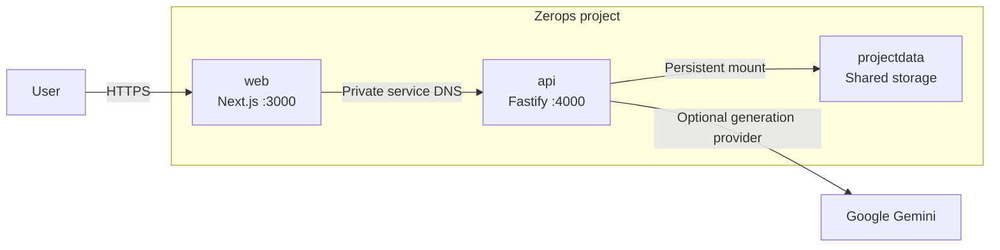

<p align="center"><strong style="font-size: 18px;">BlackIn</strong> <span style="font-size: 18px;">is a coding agent that runs directly in your browser.</span></p>
<p align="center">
 
</p>
<p align="center">
  
  
  
  
  <a href="https://github.com/ayushshrivastv/BlackIn-Zerops/actions/workflows/deploy-zerops.yml"></a>
</p>

BlackIn is a browser based coding agent. You describe what you want to build in english, and BlackIn plans the work, writes the code, and produces a complete runnable project. Powered by servers running on Zerops. Try it at: https://web-2ad8-3000.prg1.zerops.app

Watch the demo: https://youtu.be/IAhL4Zv_43Y

## About

BlackIn Studio is an AI application development platform that turns a product requirement into a structured, editable project. Describe a SaaS product, customer portal, operations dashboard, booking flow, landing page, or internal tool, and BlackIn creates the application while streaming progress into a live development workspace.

The workspace keeps the entire build process in one place. Generated files appear in a navigable project tree, source can be inspected in the integrated editor, implementation plans and runtime events remain visible beside the conversation, and completed projects can be downloaded as portable ZIP archives. Projects and their message history are persisted so work can be reopened and continued by project identifier.

BlackIn is designed as a complete product system. The browser application, generation API, model orchestration, workspace validation, project storage, and deployment configuration are developed together in one TypeScript monorepo and operated on Zerops.

<p align="center">
 

## How it works

A project begins with a plain-language instruction. BlackIn validates the request, creates a project record, and streams generation events as the application is assembled. The generation service works inside an isolated virtual workspace where it can list, read, write, and remove project files without gaining shell access or access to the host repository.

Before a project is saved, BlackIn validates its paths, file count, total size, package manifest, build scripts, and application entry point. Validated files are written to persistent storage and returned to the workspace, where they can be reviewed, edited, synchronized, reopened, or exported.

The workspace preview action sends a completed project to the API preview compiler. Supported React and Next.js-style application entry points are bundled in memory, wrapped in a restricted preview document, and rendered in the project panel. The same preview can be opened in a separate browser tab without publishing the generated project as a new public service.

When `GEMINI_API_KEY` is configured, BlackIn uses Google Gemini for model-backed project generation. Without a key, it selects the built-in deterministic generator so the full product workflow remains available for local development, testing, and deployment verification.

<p align="center">


<p align="center">


## Platform

BlackIn combines a Next.js application with a Fastify generation service. Next.js provides the product experience, project workspace, server-side API gateway, and production application artifact. Fastify provides request validation, generation streams, WebSocket events, project lifecycle operations, file synchronization, persistence, and archive creation.

The API streams newline-delimited generation events instead of waiting for an entire project to finish before responding. This keeps planning, file creation, progress, and completion states visible as they occur. The same service contract is used by both the Gemini provider and the deterministic provider.

Project data is stored as atomic JSON records with restrictive file permissions. This storage model keeps the system operationally simple while preserving generated files, metadata, and conversation history across requests and application deployments.

## Zerops

BlackIn was built for the WeMakeDevs Zerops Hackathon, with Zerops serving as the runtime and deployment platform for the complete product. The repository includes a production `zerops.yml` that defines the build environment, runtime environment, deployable artifacts, caches, ports, readiness checks, service networking, and startup commands for the complete system.

The deployment uses two Node.js 20 services and one shared storage service. The `web` service runs the standalone Next.js application on port `3000` and is the only service that requires public access. The `api` service runs Fastify on port `4000` and remains private. Zerops service DNS allows the application to reach the API at `http://api:4000`, so browser requests can use the same-origin `/api/v1` gateway without exposing the API directly.

The `projectdata` service is mounted into the API runtime. Generated projects are stored under `/mnt/projectdata/blackin`, allowing runtime containers and application versions to be replaced without losing project records. The system does not require AWS, an external object store, or a separate container platform.



### Git deployment

Pushes to `main` automatically deploy the complete application through the `Deploy to Zerops` GitHub Actions workflow. The workflow explicitly selects the matching setup from `zerops.yml`, deploys `api` before `web`, and prevents competing build containers from racing for project resources. It can also be started manually from the repository's Actions page.

Authentication is provided by the encrypted `ZEROPS_TOKEN` repository secret. The token is scoped to the BlackIn Zerops project and is never stored in the source tree or workflow logs. Both services use the same committed source while Zerops builds, releases, and verifies each runtime with its own pipeline definition.

Create a shared storage service named `projectdata` and mount it on `api`. Add `GEMINI_API_KEY` as an API service secret when model-backed generation is required, then deploy `api` before `web`. Public subdomain access should be enabled for `web` and left disabled for `api`.

The included `zerops-project-import.example.yml` documents the expected project topology. Add the repository URL before using it as an import definition.

### zCLI deployment

The same pipelines can be triggered from a clean local checkout with zCLI:

```bash
zcli login <token>
zcli scope project <project-id>

zcli service push api --setup api --workspace-state clean
zcli service push web --setup web --workspace-state clean
```

`zcli service push` uploads the selected workspace state, runs the matching build pipeline, deploys the resulting artifact, and waits for the configured service checks. `.deployignore` prevents local caches, generated output, logs, project data, and development artifacts from entering the upload.

### Runtime verification

The public application should return a successful response after both pipelines are active:

```bash
curl --fail --silent --show-error \
  https://web-2ad8-3000.prg1.zerops.app/ > /dev/null
```

The API runtime can be verified from its Zerops terminal without making the service public:

```bash
curl --fail http://127.0.0.1:4000/health
curl --fail http://127.0.0.1:4000/api/v1/health
test -d /mnt/projectdata/blackin && echo "Shared storage mounted"
```

## Configuration

Production defaults are declared in `zerops.yml`. The web runtime receives `API_INTERNAL_URL=http://api:4000`, and the API runtime receives its host, port, storage path, generation provider, and default model configuration. Sensitive values belong in Zerops service secrets and must never be committed.

Model-backed generation requires one secret:

```bash
GEMINI_API_KEY=<secret>
```

`GENERATION_PROVIDER=auto` selects Gemini when the key is present and the deterministic provider when it is absent. `GEMINI_MODEL` can be changed on the API service without changing the application service. Additional supported values are documented in `zerops.env.example` and `apps/api/.env.example`.

| Variable | Service | Purpose |
| --- | --- | --- |
| `GEMINI_API_KEY` | API | Enables Gemini-backed project generation. Store it as a secret. |
| `GEMINI_MODEL` | API | Selects the Gemini model used by the generation agent. |
| `GENERATION_PROVIDER` | API | Chooses `auto`, `gemini`, or the deterministic `demo` provider. |
| `DATA_DIR` | API | Sets the project persistence directory. Zerops uses `/mnt/projectdata/blackin`. |
| `API_AUTH_TOKEN` | API | Optionally protects `/api/v1` routes with a shared bearer token. |
| `CORS_ORIGINS` | API | Lists browser origins allowed to call the API. |
| `API_INTERNAL_URL` | Web | Points the server-side gateway to the private API service. |

## Development

BlackIn requires Node.js 20 and uses pnpm 10.15.1 through Corepack. Start from a clean checkout:

```bash
git clone git@github.com:ayushshrivastv/BlackIn-Zerops.git
cd BlackIn-Zerops
corepack enable
pnpm install --frozen-lockfile
pnpm dev
```

The application runs at `http://localhost:3000`, and the generation API runs at `http://localhost:4000`. The local server gateway automatically targets the API at port `4000`, so no endpoint configuration is required for the standard development workflow.

To enable Gemini locally, create an ignored `.env.local` file at the repository root:

```bash
GEMINI_API_KEY=<local-development-key>
GENERATION_PROVIDER=auto
```

Leave `GEMINI_API_KEY` unset to use the deterministic provider. This mode exercises generation streams, persistence, file inspection, downloads, and previews without calling an external model.

## Validation

Run the focused application and API checks before publishing changes or triggering a production pipeline:

```bash
pnpm typecheck:api
pnpm test:api
pnpm --filter web lint
pnpm --filter web build
```

The API suite covers health reporting, streamed generation, project persistence, archive downloads, file synchronization, and workspace path protections. The production build validates application routes, server-side API forwarding, static assets, and the standalone artifact deployed by Zerops.

## Security

BlackIn keeps model execution inside a virtual text workspace rather than granting it shell access. Generated paths are normalized and restricted from writing into `.git`, dependency directories, build output, or secret environment files. File count, per-file size, and total workspace size limits are enforced before persistence.

Interactive previews accept a small allowlist of browser packages, compile source in memory, and render it with a restrictive Content Security Policy. API logs redact authorization headers and model keys supplied through the interface. Production credentials belong in Zerops service secrets or GitHub Actions secrets and are not stored in the repository.

## Repository

```text
.
|-- apps
|   |-- api                 Generation, persistence, and project APIs
|   `-- web                 Product experience and project workspace
|-- packages
|   |-- config-eslint       Shared linting rules
|   |-- config-typescript   Shared TypeScript configuration
|   `-- types               Shared project and stream contracts
|-- zerops.yml              Zerops build and runtime definitions
|-- zerops.env.example      Runtime configuration reference
|-- zerops-project-import.example.yml
|                            Zerops project topology
`-- .deployignore           Deployment upload exclusions
```

Application routes live in `apps/web/app`, while reusable product components, state, hooks, and server integrations live in `apps/web/src`. The API separates generation providers, orchestration, storage, archive creation, and workspace policy under `apps/api/src`. Shared contracts remain in `packages/types`.

## Status

BlackIn currently supports prompt-driven generation, staged agent progress, project persistence, project reopening, file synchronization, source inspection, interactive previews, new-tab previews, ZIP export, deterministic generation, Gemini generation, and Zerops deployment. The public demonstration runs in development access mode and does not require sign-in. Account management, team workspaces, direct repository publishing, billing, and automated public deployment of generated projects are planned product extensions.
