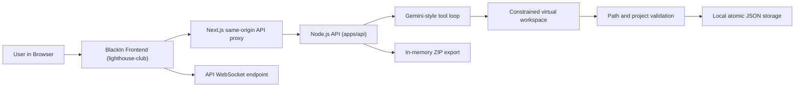

# BlackIn Studio Frontend

## Project Description

BlackIn Studio is an agentic AI powered Web2 app builder. It turns one plain-English product prompt into an editable, downloadable project with screens, components, API routes, file structure, and deployment configuration.

## BlackIn Studio - Agentic Web App Builder

Builders can describe a SaaS dashboard, customer portal, admin panel, landing page, booking flow, or internal tool and immediately review the generated project files. The browser provides the workspace while the local Node.js backend runs the generation agent, streams progress, and persists projects without an AWS dependency.

Building a Web2 MVP today still requires moving between product notes, UI design, boilerplate setup, routing, forms, API boundaries, state handling, and deployment configuration. That setup can consume the first day of a hackathon before the product experience exists.

BlackIn compresses that loop. You open the app, describe the product in plain language, and the AI plans the application, generates the frontend, prepares route and API structure, and keeps the result visible in a browser workspace with chat, file tree, code editor, and terminal.

After initial generation, the project can be refined through chat in the same workspace by asking for layout changes, new pages, workflow updates, form states, API wiring, and deployment preparation.

The final outcome is one prompt producing a complete Web2 app package with editable files, product structure, implementation plan, and deployment readiness.

## Project Links

The product walkthrough video is available at https://www.youtube.com/watch?v=UGXNKP0y-ZM.

## Run the Complete App

Install dependencies and start both workspace services:

```bash
pnpm install
pnpm dev
```

The frontend runs at `http://localhost:3000`; the generation API and WebSocket endpoint run at `http://localhost:4000`. Next.js proxies `/api/v1/*` to the API, so no local frontend environment variable is required.

The backend selects its provider automatically:

- With `GEMINI_API_KEY` in the root `.env.local`, it runs the Gemini tool-driven generator.
- Without a key, it runs a local demo generator. The full prompt, stream, persistence, editor, and ZIP workflow still works offline.

Useful checks are `pnpm test:api`, `pnpm typecheck:api`, `pnpm --filter web lint`, and `pnpm build`.

## Generation Backend

The backend lives in `apps/api` and follows the useful boundaries from Gemini CLI: the web UI is separate from the agent core, generation is an iterative tool loop, and all file tools are constrained to an isolated project root. The model can list, read, write, and delete virtual files, but it cannot run shell commands or access the host workspace. Generated paths, file sizes, project size, `package.json`, and application entry points are validated before the project is saved.

Projects and chat history are stored as atomic JSON files under `.data/projects`. This is intentionally simple for local development and a single-container hackathon deployment. Generated projects can be downloaded as ZIP files directly from the API.

Core endpoints:

- `POST /api/v1/generate` streams newline-delimited generation events.
- `POST /api/v1/contract/get-chat` reloads chat and generated files.
- `GET /api/v1/projects/:projectId` returns a complete stored project.
- `POST /api/v1/files/sync` saves editor changes.
- `POST /api/v1/github/get-zip-file` exports the generated project.
- `GET /api/v1/health` reports provider and persistence status.

The design references the official [Gemini CLI architecture](https://github.com/google-gemini/gemini-cli/blob/main/GEMINI.md), [filesystem tool model](https://github.com/google-gemini/gemini-cli/blob/main/docs/tools/file-system.md), and [tool policy concepts](https://github.com/google-gemini/gemini-cli/blob/main/docs/reference/policy-engine.md).

## Deploy to Zerops

This repository includes a two-service `zerops.yml`. Create Node.js 20 services with hostnames `web` and `api`; enable public subdomain access only for `web`. Zerops resolves the backend privately as `http://api:4000`, and the frontend proxies browser API traffic to it.

Add `GEMINI_API_KEY` as a secret on the `api` service. If it is omitted, the deployed app uses demo generation. The frontend remains in hackathon access mode, with wallet/auth integrations disabled.

You can deploy either by connecting the `web` service to your GitHub/GitLab repository, or manually with zCLI from the repo root:

```bash
zcli push api --working-dir . --zerops-yaml-path zerops.yml
zcli push web --working-dir . --zerops-yaml-path zerops.yml
```

Use `zerops-project-import.example.yml` as a starting point if you want to create the Zerops project from an import file. Add your real repository URL to `buildFromGit` before importing it.

## Frontend Project Structure

Frontend application routes and layouts are implemented in `apps/web/app`. The generation API is implemented in `apps/api/src`; its `generation`, `services`, `storage`, and `lib` folders separate model orchestration, workflows, persistence, and security policy. Shared frontend types remain in `packages/types`.

## Project Architecture Diagram


